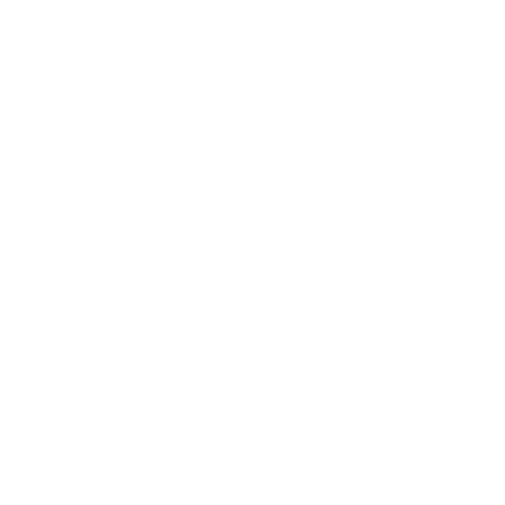

# About me

Hi, I'm Nikita and I'm from 🇨🇿.

I love programming, but also an open-source and security enthusiast, a gamer, and many more.

I've recently got into the world of free software, that's also the reason why you're reading this.

## I'm currently experienced in:

- Developing Python scripts and simple GUI applications
- Creating websites

## I'm interested in:

- Game development

# Programming technologies I use

## General purpose

    
    
    

## Web development

    
    
    
    
    

## Game development

    

## Databases

    

## Other

    

# Other technologies I use

    

# Technologies I use in my personal life

    
    

# Credits

Icons from https://github.com/simple-icons/simple-icons